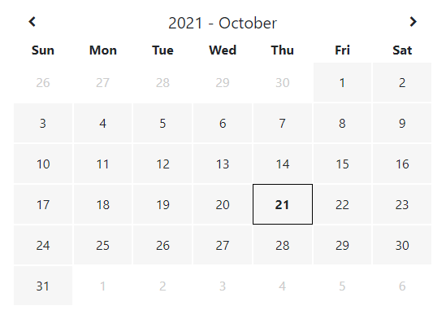
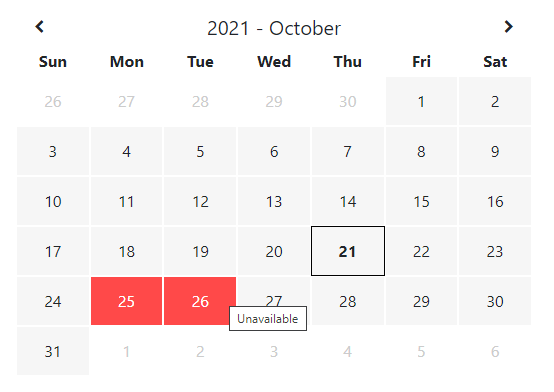
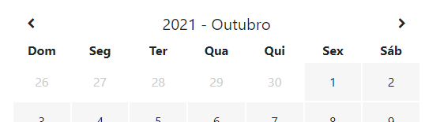
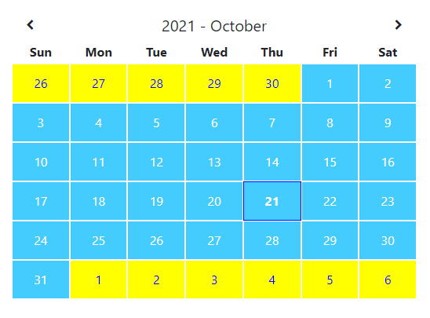

# Bozz Calendar

It is a simple library to display a calendar with status of days using an array of objects to pass colors and status.

This library was generated with [Angular CLI](https://github.com/angular/angular-cli) version 12.0.5.

## &nbsp;

## Latest version is 0.1.0

## &nbsp;

## How to install

1 - Run this:

```
npm i bozz-calendar
```

2 - Add `BozzCalendarModule` on the `imports:` in your `app.module` like this:

```
@NgModule({
  declarations: [AppComponent],
  imports: [
    BrowserModule,
    AppRoutingModule,
    BozzCalendarModule
  ],
  providers: [],
  bootstrap: [AppComponent],
})
```

3 - To show the calendar just put this tag in your `HTML`:

```
<lib-bozz-calendar></lib-bozz-calendar>
```

## &nbsp;

## The Default Calendar

<p>
    
</p>

## &nbsp;

## How send status from the days?

1 - In your `.ts` file create an object array like this:

```
public dates = [
    {
      date: new Date(2021, 9, 25),
      status: 'Unavailable',
      bg: '#ff4949',
      color: '#ffffff',
    },
    {
      date: new Date(2021, 9, 26),
      status: 'Unavailable',
      bg: '#ff4949',
      color: '#ffffff',
    },
];
```

2 - Send to lib in the `HTML` file like this:

```
<lib-bozz-calendar [dates]="dates"></lib-bozz-calendar>
```

And you will see the calendar with status an hint on the selected days:

<p>
    
</p>

## &nbsp;

## Can I translate the calendar?

1 - Yes! In your `.ts` file you can create an array for the `months` and another for de `week` like this:

```
public monthsPT-BR: any = [
    'Janeiro',
    'Fevereiro',
    'Março',
    'Abril',
    'Maio',
    'Junho',
    'Julho',
    'Augosto',
    'Setembro',
    'Outubro',
    'Novembro',
    'Dezembro',
];

public weekPT-BR = ['Dom', 'Seg', 'Ter', 'Qua', 'Qui', 'Sex', 'Sáb'];
```

2 - Send to lib in the `HTML` file like this:

```
<lib-bozz-calendar [months]="monthsPT-BR" [week]="weekPT-BR"></lib-bozz-calendar>
```

And now your calendar will apears translated:

<p>
    
</p>

## &nbsp;

## And the other colors "bro"?

You've already seen how to send colors for day statuses. But you can also customize the colors of the entire calendar.

1 - Create an object in your `.ts` file like this:

```
public colors: any = {
    daysMonthBgColor: '#44ccff',
    daysMonthTxColor: '#ffffff',
    noDaysMonthBgColor: '#ffff00',
    noDaysMonthTxColor: '#0000ff',
    todayTxColor: '#0000ff',
    todayBdColor: '#0000ff',
};
```

2 - Send to lib in the `HTML` file like this:

```
<lib-bozz-calendar [colors]="colors"></lib-bozz-calendar>
```

And your beautiful calendar will look like this:

<p>
    
</p>

## &nbsp;

## GITHUB

<p>
    Project to my personal libs: <a href="https://github.com/brunobozz/bozz-libs" taget="_blank">bozz-libs</a>
</p>

## &nbsp;

## CONTACT

Bruno Bozzetti
instagram.com/@brunobozz
brunobozz@gmail.com
